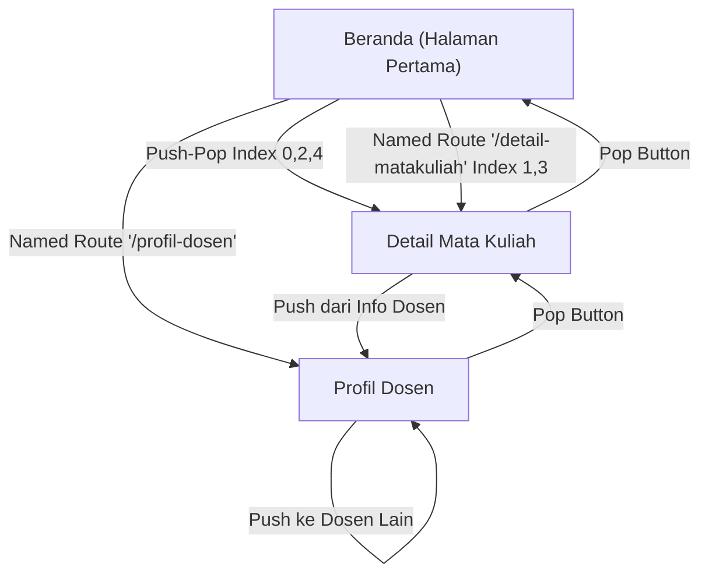

# 📱 Dokumentasi Aplikasi Akademik dengan Navigasi dan Routing

## 🎯 Deskripsi Aplikasi
Aplikasi akademik sederhana yang menampilkan dashboard mahasiswa dengan tiga halaman:
1. **Beranda** - Dashboard utama dengan daftar mata kuliah
2. **Detail Mata Kuliah** - Informasi detail tentang mata kuliah tertentu
3. **Profil Dosen** - Informasi profil dosen dan keahliannya

---

## 📐 Struktur Halaman Aplikasi

```
┌─────────────────────────────────────────────────────────┐
│                 APLIKASI AKADEMIK                         │
└─────────────────────────────────────────────────────────┘
                            │
        ┌───────────────────┼───────────────────┐
        │                   │                   │
    Beranda          Detail Mata Kuliah   Profil Dosen
    (Home)           (Detail)              (Profile)
        │                   │                   │
        └───────────────────┼───────────────────┘
                NavRouter ↔ Generated Routes
```

---

## 🔄 Alur Navigasi Aplikasi



---

## 📌 Teknik Navigasi yang Digunakan

### **1. PUSH-POP (Manual Navigation) - Untuk Mata Kuliah Genap**

#### Penggunaan:
```dart
Navigator.of(context).push(
  MaterialPageRoute(
    builder: (context) => DetailMataKuliahPage(
      mataKuliah: mataKuliah,
    ),
  ),
);
```

#### Karakteristik:
- ✅ Menambahkan screen baru ke navigation stack
- ✅ Tombol back akan otomatis muncul
- ✅ User bisa pop kembali dengan `Navigator.pop(context)`
- ✅ Cocok untuk transisi sederhana antar screen

#### Implementasi di Aplikasi:
- Tombol mata kuliah dengan **index genap (0, 2, 4, ...)** menggunakan teknik ini
- Ditandai dengan label "Push-Pop"
- Contoh: Pemrograman Lanjut (index 0), Algoritma (index 2)

---

### **2. NAMED ROUTES - Untuk Mata Kuliah Ganjil**

#### Setup Routes:
```dart
MaterialApp(
  routes: {
    '/': (context) => const BerandaPage(),
    '/profil-dosen': (context) => const ProfilDosenPage(),
  },
  onGenerateRoute: (settings) {
    if (settings.name == '/detail-matakuliah') {
      final mataKuliah = settings.arguments as MataKuliah;
      return MaterialPageRoute(
        builder: (context) => DetailMataKuliahPage(
          mataKuliah: mataKuliah,
        ),
      );
    }
  },
)
```

#### Penggunaan:
```dart
Navigator.of(context).pushNamed(
  '/detail-matakuliah',
  arguments: mataKuliah,  // Kirim data sebagai argument
);
```

#### Karakteristik:
- ✅ Navigasi menggunakan string identifier (route name)
- ✅ Deep linking lebih mudah
- ✅ Dapat mengirim arguments/data
- ✅ Centralized route management
- ✅ Lebih scalable untuk aplikasi besar

#### Implementasi di Aplikasi:
- Tombol mata kuliah dengan **index ganjil (1, 3, ...)** menggunakan teknik ini
- Ditandai dengan label "Named"
- Contoh: Basis Data (index 1), Keamanan Sistem (index 3)

---

## 📤 Pengiriman Data (Data Passing)

### **Skenario 1: Beranda → Detail Mata Kuliah (Pass Data)**

```dart
// Dari Beranda
final mataKuliah = daftarMataKuliah[index];

// Metode 1: Push-Pop
Navigator.of(context).push(
  MaterialPageRoute(
    builder: (context) => DetailMataKuliahPage(
      mataKuliah: mataKuliah,  // ← Data dikirim sebagai constructor parameter
    ),
  ),
);

// Metode 2: Named Route
Navigator.of(context).pushNamed(
  '/detail-matakuliah',
  arguments: mataKuliah,  // ← Data dikirim sebagai arguments
);
```

### **Skenario 2: Detail Mata Kuliah → Profil Dosen (Pass Data)**

```dart
// Dari Detail Mata Kuliah
Navigator.of(context).push(
  MaterialPageRoute(
    builder: (context) => ProfilDosenPage(
      namaDosenAwal: mataKuliah.dosen,  // ← Filter nama dosen
    ),
  ),
);
```

### **Skenario 3: Profil Dosen → Profil Dosen Lain (Push ke Halaman Sama)**

```dart
// Dari Profil Dosen (lihat dosen lain)
Navigator.of(context).push(
  MaterialPageRoute(
    builder: (context) => ProfilDosenPage(
      namaDosenAwal: dosen.nama,  // ← Update dengan dosen berbeda
    ),
  ),
);
```

---

## 🔐 Data Model

### **Class MataKuliah**
```dart
class MataKuliah {
  final String id;
  final String nama;
  final String dosen;
  final int sks;
  final String hari;
  final String jam;
  final String ruangan;
  final double nilai;
}
```

### **Class Dosen**
```dart
class Dosen {
  final String id;
  final String nama;
  final String nidn;
  final String email;
  final String telepon;
  final String pendidikan;
  final String keahlian;
}
```

---

## 🚀 Flow Interaksi User

### **Flow 1: User Melihat Mata Kuliah Pemrograman Lanjut**
```
1. User di Beranda
2. Tap kartu "Pemrograman Lanjut" (index 0, gunakan Push-Pop)
3. Screen melakukan Navigator.push() dengan MataKuliah object
4. DetailMataKuliahPage menerima mataKuliah di parameter
5. Tampilkan detail: nama, dosen, jadwal, nilai
6. User tap "Lihat Profil Dosen"
7. Push ke ProfilDosenPage dengan namaDosenAwal
8. User bisa pop kembali ke Detail atau lanjut ke Profil Dosen lain
```

### **Flow 2: User Melihat Mata Kuliah Basis Data**
```
1. User di Beranda
2. Tap kartu "Basis Data" (index 1, gunakan Named Route)
3. Screen melakukan pushNamed() dengan arguments: mataKuliah
4. onGenerateRoute menangkap '/detail-matakuliah' dengan arguments
5. DetailMataKuliahPage dibuat dengan argument yang di-extract
6. Tampilkan detail yang sama seperti Flow 1
7. Proses selanjutnya identik
```

### **Flow 3: Navigasi Lintas Dosen**
```
1. User di Profil Dosen 1
2. Lihat list dosen lainnya
3. Tap dosen lain → Push ke ProfilDosenPage dengan namaDosenAwal baru
4. Terbentuk stack: Beranda → Detail → Dosen1 → Dosen2 → Dosen3
5. User bisa pop satu persatu atau langsung kembali ke Beranda
```

---

## 🔍 Perbedaan Push-Pop vs Named Route

| Aspek | Push-Pop | Named Route |
|-------|----------|-------------|
| **Syntax** | `Navigator.push()` | `Navigator.pushNamed()` |
| **Data Pass** | Constructor parameter | `arguments` di pushNamed |
| **Route Definition** | Inline in code | Centralized di routes/onGenerateRoute |
| **Deep Linking** | Sulit | Mudah |
| **Maintenance** | Tersebar | Terpusat |
| **Cocok untuk** | Sederhana, screen sedikit | Kompleks, screen banyak |
| **Contoh Pakai** | Tombol mat kuliah genap | Tombol mat kuliah ganjil |

---

## 💡 Keuntungan Menggunakan Keduanya

1. **Demonstrasi Lengkap** - User belajar dua teknik sekaligus
2. **Fleksibilitas** - Sesuaikan teknik dengan kebutuhan
3. **Best Practice** - Di app real-world biasa pakai kombinasi keduanya
4. **Scalability** - Push-pop untuk UI lokal, Named Route untuk global navigation
5. **Deep Link Ready** - Named routes mendukung deep linking (future expansion)

---

## 📋 Widget Utama yang Digunakan

- **Scaffold** - Layout dasar halaman
- **AppBar** - Header dengan title dan back button
- **Card** - Kontainer info dengan elevation
- **ListView.builder** - List dinamis mata kuliah/dosen
- **ListTile** - Item dalam list dengan leading/trailing
- **ElevatedButton** - Tombol aksi
- **Column/Row** - Layout vertical/horizontal
- **SingleChildScrollView** - Scrolling konten panjang
- **Navigator** - Navigasi push/pop/pushNamed
- **MaterialPageRoute** - Route untuk push-pop
- **onGenerateRoute** - Handle dynamic named routes

---

## 🎬 Cara Menjalankan

```bash
# Clone/setup project
cd tugas111

# Run aplikasi
flutter run -t lib/dashboard_akademik_navigasidanrouting.dart

# Atau edit main.dart mengimport file ini
```

---

## ✅ Checklist Requirement

- ✅ **3 Halaman**: Beranda, Detail Mata Kuliah, Profil Dosen
- ✅ **Push-Pop Navigation**: Index genap mata kuliah
- ✅ **Named Routes**: Index ganjil mata kuliah, Profil dosen dari Beranda
- ✅ **Data Passing**: Beranda → Detail (MataKuliah object)
- ✅ **Data Passing**: Detail → Profil (namaDosenAwal)
- ✅ **Alur Jelas**: Dokumentasi + komentar di code

---

## 📚 Referensi

- [Flutter Navigation & Routing](https://docs.flutter.dev/development/ui/navigation)
- [Named Routes](https://docs.flutter.dev/cookbook/navigation/named-routes)
- [Passing Arguments](https://docs.flutter.dev/cookbook/navigation/navigate-with-arguments)

---

**Dibuat: 28 April 2026**
**Status: Siap untuk Production**
